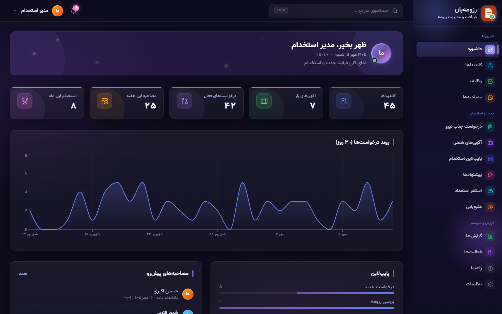
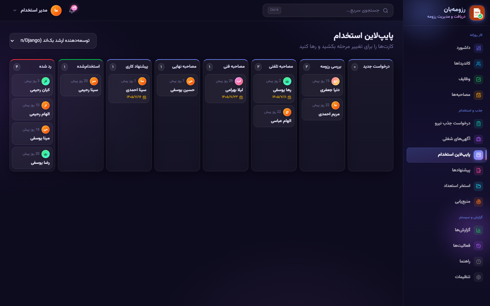
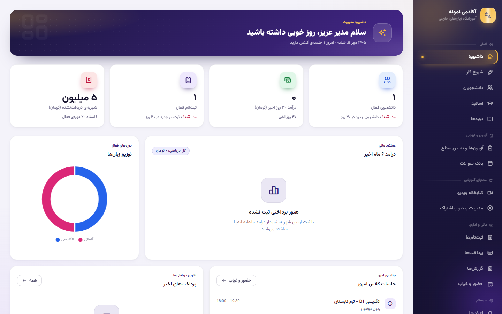
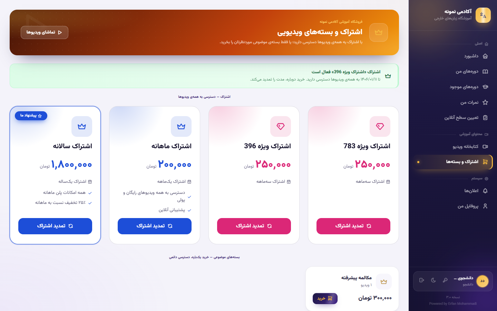
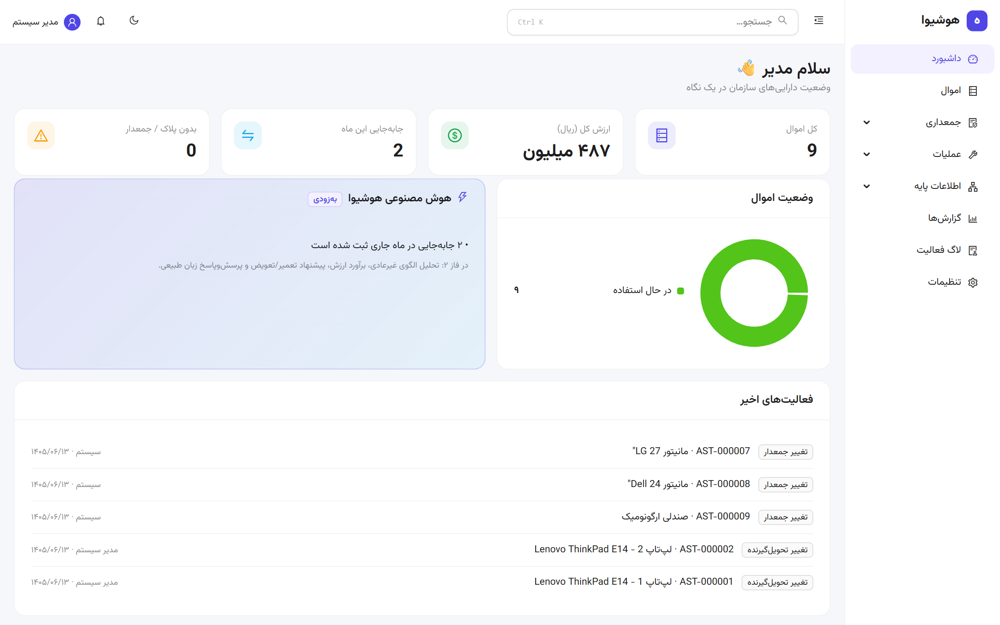
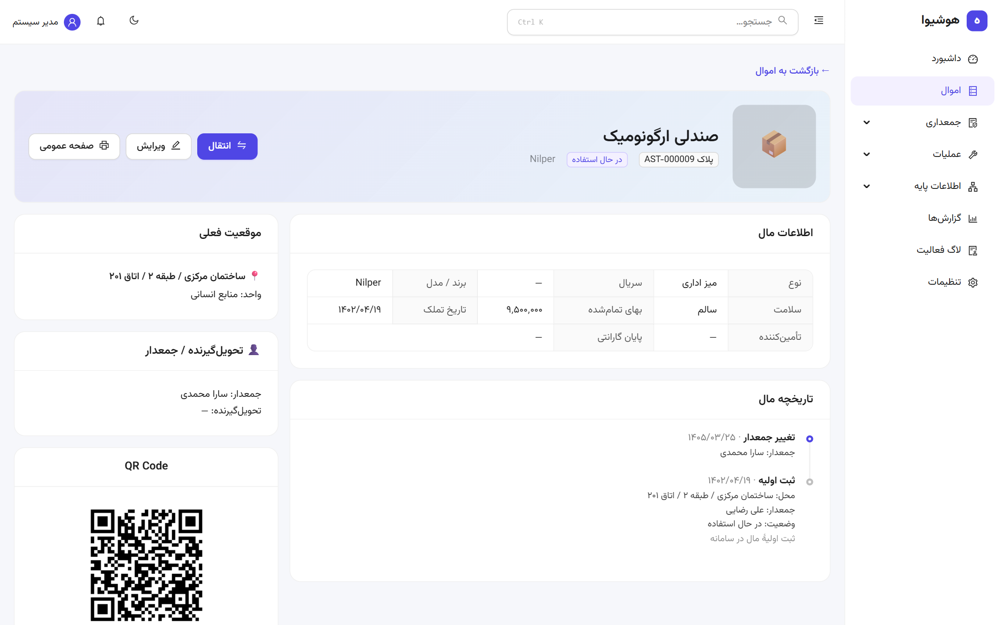
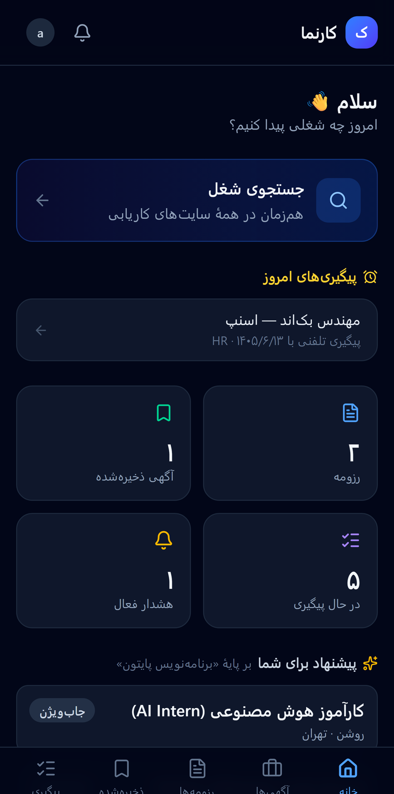
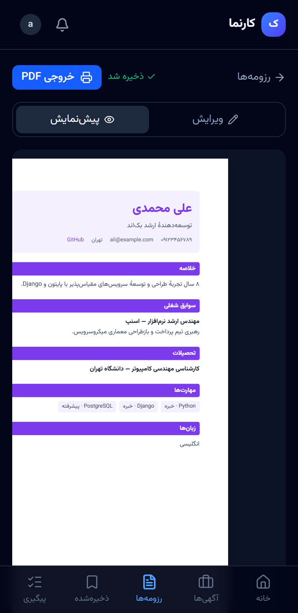

**I build enterprise web systems end to end, from the database to the API to the UI, and then I run them in production.**

---

## About me

I'm a backend developer with **4+ years of professional experience** building in-house enterprise software for an industrial manufacturer. My work centers on **Python/Django, REST APIs and Microsoft SQL Server**, and I take a system from requirements and data modelling through performance tuning to deployment.

- **Software Developer & Database Specialist at Alvan Paint & Resin** (Jul 2022 – present). I'm responsible for **more than 15 internal business modules**: inventory, sales, orders, purchasing, accounting, cashier, maintenance, calibration, HR, QA/QC, asset management and master data.
- **Founder of [Houshiva](https://houshiva.ir)** (2026 – present, part-time), a software studio that builds custom business applications.
- **Languages:** Persian (native) · English (B level, confident in technical communication) · German (A2)

### What I bring to a team

| | |
|---|---|
| 🧱 **End-to-end delivery** | Requirements → data model → REST API → React UI → tests → production. I work directly with business departments to turn their processes into software. |
| 🗄️ **Deep SQL Server** | Schema design, stored procedures, views and complex T-SQL. Performance tuning by reading execution plans, optimizing indexes and rewriting slow queries. Backup, restore and monitoring. |
| 🔗 **Building on existing systems** | New web apps on top of legacy ERP schemas, user sync and single sign-on between internal apps, and rewrites of VB.NET/WinForms modules without touching the original database. |
| 🚀 **Production on real infrastructure** | Docker, nginx and Windows services on on-premise servers, with obfuscated builds for the code that ships. |
| 🌐 **Persian / RTL products** | Fully right-to-left interfaces, Jalali dates, and locally bundled fonts for offline corporate networks. |

---

## Featured work

> Most of my production work is for my employer or for clients, so the repositories are **private**. All screenshots below use **sample data**. Code walkthroughs and live demos are available on request.

### 📋 RezumeBan: recruiting & applicant tracking system (ATS)

A complete hiring platform, in use at Alvan:
- job requisitions with manager approval → job postings → a drag-and-drop **Kanban pipeline**
- interviews with **weighted scorecards** and calendar (.ics) invites → **offers**
- funnel and source-effectiveness **reports**
- résumé import with duplicate detection and merging, side-by-side candidate comparison
- candidate sourcing from the GitHub, Stack Overflow and dev.to APIs
- a `Ctrl+K` command palette

`Django 6` `DRF` `JWT` `React 19` `Vite` `Tailwind CSS 4` `Framer Motion` `Recharts` · 31 automated tests

<table>
<tr>
<td width="50%"></td>
<td width="50%"></td>
</tr>
</table>

### 🎓 Avana: multi-tenant SaaS for language schools *(Houshiva)*

A cloud platform that language schools subscribe to (monthly or yearly, with a free trial). It covers students, teachers, courses, attendance, placement and online exams, tuition, a **video store with subscriptions and topic bundles**, certificates and financial reports. Users log in with an **SMS one-time code**. It is **multi-tenant and white-label**, with an owner console for managing every customer school.

`Django REST Framework` `React` `Multi-tenancy` `Subscriptions & billing`

<table>
<tr>
<td width="50%"></td>
<td width="50%"></td>
</tr>
</table>

### 🏷️ Houshiva Asset: asset & custodianship management *(Houshiva)*

A configurable product for controlling an organization's physical assets. It tracks custodians and handovers, movements between locations, **QR-code labels** with a public lookup page, inventory counts with discrepancy reports, maintenance, an **Excel import** and custom fields. Installable as a **PWA**.

`Django 5.2 LTS` `DRF` `React` `PostgreSQL` `PWA`

<table>
<tr>
<td width="50%"></td>
<td width="50%"></td>
</tr>
</table>

### 💼 Karnama: job search & résumé builder PWA *(Houshiva)*

A mobile-first app for job seekers:
- **searches several job sites at once**, merging results and removing duplicates
- a **Persian résumé builder** with live preview, templates and PDF export
- a board for tracking applications, plus job alerts and personalized suggestions

`React` `PWA` `Web scraping`

<table>
<tr>
<td width="50%" align="center"></td>
<td width="50%" align="center"></td>
</tr>
</table>

### 🧭 Software Knowledge Center: internal IT operations platform

The IT team's daily workspace:
- documentation, tasks and issues, a phone directory and live user presence
- **access control and auditing across three SQL Server instances**: who can see what, copying access between users, segregation-of-duties checks
- a SQL query console and a database audit
- the **single sign-on hub** for the other internal apps

`Django` `DRF` `React` `MUI` `SQL Server` `Docker` `nginx`

### 📊 Management Dashboard & Performance Analytics

One dashboard over the ERP data for management, with modules for **HR** (headcount, attrition, age pyramid, accidents, contracts), **accounting** (ledger, trial balance, balance sheet, income statement), **assets**, **inventory**, **cash and cheques**, **maintenance** and **market pricing**. Domain chatbots for HR and quality questions are built in, and access is controlled per module.

`React` `Ant Design` `Recharts` `Python` `SQL Server`

### 🎨 Alvan Color Visualizer: AI wall-color preview

A sales tool. The customer uploads a photo of a room or building, and the app detects the walls with **Mask2Former semantic segmentation**. It then repaints them in colors from the company catalogue, keeping the original light, shadow and texture (Lab color space, guided-filter edges, linear-light compositing). All models run **locally**, so there is no per-use API cost.

`Python` `FastAPI` `PyTorch` `Transformers` `OpenCV` `JavaScript`

### 🛠️ More systems

| Project | What it is | Stack |
|---|---|---|
| **PM Factory** | Maintenance-management (CMMS) rewrite of the ERP's VB.NET/WinForms module as a web platform, with ERP user sync and server-side PDF reports | Django · DRF · React · TypeScript · PostgreSQL |
| **Market Intelligence** | Collects, normalizes and matches competitor product and price data, with an *evidence chain* that traces every dashboard number back to its raw source | Django · Celery · Redis · PostgreSQL · React |
| **Price Inquiry & Asset Valuation** | Automated price inquiries and asset valuation | Django · REST API · React · SQL Server |
| **Document Management** | Company-wide document repository with search and workflow features | Django · React · SQL Server |
| **Client work** *(Houshiva)* | Corporate website relaunch (WordPress → React + Django); café ordering and table-reservation platform with SMS one-time-password login; digital menu with admin panel and online ordering | React · Django |

### 🌍 Public repositories

| Repository | Description |
|---|---|
| [**portfolio**](https://github.com/erfanmohammadi1998/portfolio) | My portfolio, live at [erfanmohammadi.ir](https://erfanmohammadi.ir). It's an interactive architecture map plus an API console you can query (`GET /projects`, `whoami`). Trilingual (fa / en / de) and RTL-aware |
| [**ticket-management-system**](https://github.com/erfanmohammadi1998/ticket-management-system) | Full-stack support-ticket system with role-based access and a dashboard, built with Django REST Framework, React and SQL Server |
| [**ip_killswitch**](https://github.com/erfanmohammadi1998/ip_killswitch) | Small Python utility that closes chosen apps when your public IP changes, e.g. when a VPN drops. Fail-safe by design |

---

## Technical skills

| Area | Skills |
|---|---|
| **Backend** | **Python, Django, Django REST Framework, REST API design** (advanced) · JWT auth, OpenAPI/Swagger · FastAPI · VB.NET (good) |
| **Databases** | **MS SQL Server, T-SQL, PostgreSQL, MySQL** (advanced): performance tuning, execution plans, indexing, stored procedures · SSIS (basic) |
| **Frontend** | React, JavaScript, HTML/CSS, Vite, Tailwind CSS, MUI, Ant Design, Recharts (good) · TypeScript (basic) |
| **DevOps & tools** | Git (advanced) · Docker, Docker Compose, GitLab, nginx, Windows Server services (good) |
| **Reporting & BI** | Crystal Reports (advanced) · Stimulsoft Reports, Power BI, Excel, Access (good) |
| **Other** | OpenCV, Selenium, semantic segmentation with PyTorch (basic) · AI-assisted development |

---

## Experience

**Software Developer & Database Specialist** · Alvan Paint & Resin, Tehran · *07/2022 – present*
Designed, built and maintain 15+ internal business modules · translate business logic into data models with the departments that use them · SQL Server design, tuning and maintenance · backend services and REST APIs · Docker environments · code reviews and technical documentation

**Founder & Software Developer** (part-time) · Houshiva, Tehran · *2026 – present*
Custom software for small and medium-sized businesses: websites, online shops, POS, CRM, inventory and accounting systems, dashboards and API integrations, from requirements analysis to deployment and support

**Professional training & own projects** · *07/2020 – 06/2022*
Specialized in databases and Python (350+ hours of training) · built a CV database (Django + React) and an incident-reporting system

## Education & training

- **Bachelor's degree in Web Programming**, University of Applied Science and Technology (Gostaresh Informatics), Tehran · *09/2026 – present, part-time*
- **Associate degree in Computer Software**, Imam Sadegh Technical College, Tehran · *2015 – 2017*
- **~420 hours of professional training**: SQL Server Performance & Tuning (75 h) · Business Intelligence (90 h) · SQL Server Querying and Advanced T-SQL: window functions & columnstore (75 h) · Python & Advanced Python (90 h) · Power BI (30 h) · Data Analysis (30 h) · AI Engineering (30 h)

---

## Activity

<picture>
  <source media="(prefers-color-scheme: dark)" srcset="https://raw.githubusercontent.com/erfanmohammadi1998/erfanmohammadi1998/gh-pages/github-contribution-grid-snake-dark.svg" />
  
</picture>

---

**Let's build something reliable.**
[erfanmohammadi.ir](https://erfanmohammadi.ir) · [LinkedIn](https://www.linkedin.com/in/erfan-mohammadi77/) · [erfan.mohammadi.alv77@gmail.com](mailto:erfan.mohammadi.alv77@gmail.com)

