

**I build enterprise web systems end to end, from the database to the API to the UI, and then I run them in production.**

---

## About me

I'm a backend developer with **4+ years of professional experience** building in-house enterprise software for an industrial manufacturer. My work centers on **Python/Django, REST APIs and Microsoft SQL Server**, and I take a system from requirements and data modelling through performance tuning to deployment.

- **Software Developer & Database Specialist at Alvan Paint & Resin** (Jul 2022 – present). I'm responsible for **more than 15 internal business modules**: inventory, sales, orders, purchasing, accounting, cashier, maintenance, calibration, HR, QA/QC, asset management and master data.
- **Founder of [Houshiva](https://houshiva.ir)** (2026 – present, part-time), a software studio that builds custom business applications.
- **Languages:** Persian (native) · English (B level, confident in technical communication) · German (A2)

### What I bring to a team

| | |
|---|---|
| 🧱 **End-to-end delivery** | Requirements → data model → REST API → React UI → tests → production. I work directly with business departments to turn their processes into software. |
| 🗄️ **Deep SQL Server** | Schema design, stored procedures, views and complex T-SQL. Performance tuning by reading execution plans, optimizing indexes and rewriting slow queries. Backup, restore and monitoring. |
| 🔗 **Building on existing systems** | New web apps on top of legacy ERP schemas, user sync and single sign-on between internal apps, and rewrites of VB.NET/WinForms modules without touching the original database. |
| 🚀 **Production on real infrastructure** | Docker, nginx and Windows services on on-premise servers, with obfuscated builds for the code that ships. |
| 🌐 **Persian / RTL products** | Fully right-to-left interfaces, Jalali dates, and locally bundled fonts for offline corporate networks. |

---

## Featured work

> Much of my production work is for my employer or for clients, so many repositories are **private**. All screenshots use **sample data**. Code walkthroughs and live demos are available on request. Full portfolio: [erfanmohammadi.ir](https://erfanmohammadi.ir/en/).

### 📋 RezumeBan: recruiting & applicant tracking system (ATS) · [repo](https://github.com/erfanmohammadi1998/rezumeban)

A complete hiring platform, in use at Alvan:
- job requisitions with manager approval → job postings → a drag-and-drop **Kanban pipeline**
- interviews with **weighted scorecards** and calendar (.ics) invites → **offers**
- funnel and source-effectiveness **reports**
- résumé import with duplicate detection and merging, side-by-side candidate comparison
- candidate sourcing from the GitHub, Stack Overflow and dev.to APIs, and a `Ctrl+K` command palette

`Django 6` `DRF` `JWT` `React 19` `Vite` `Tailwind CSS 4` `Framer Motion` `Recharts` · 31 automated tests

<table>
<tr>
<td width="50%"></td>
<td width="50%"></td>
</tr>
</table>

### 🏷️ Amvalyar: asset & custody management · [repo](https://github.com/erfanmohammadi1998/amvalyar)

A configurable product for the physical control of an organization's assets: custodians and hand-over documents, an **immutable movement ledger**, **QR-code labels** with a public lookup page, **mobile stock-taking** with automatic discrepancy reports, maintenance work orders, **Excel import**, custom fields and multi-tenant SaaS mode. Installable as a **PWA**.

`Django 5.2 LTS` `DRF` `React` `TypeScript` `Ant Design` `PostgreSQL` `PWA`

<table>
<tr>
<td width="50%">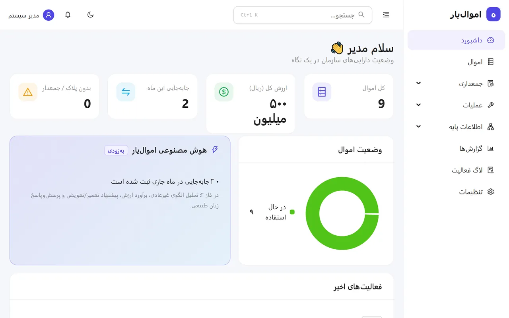</td>
<td width="50%">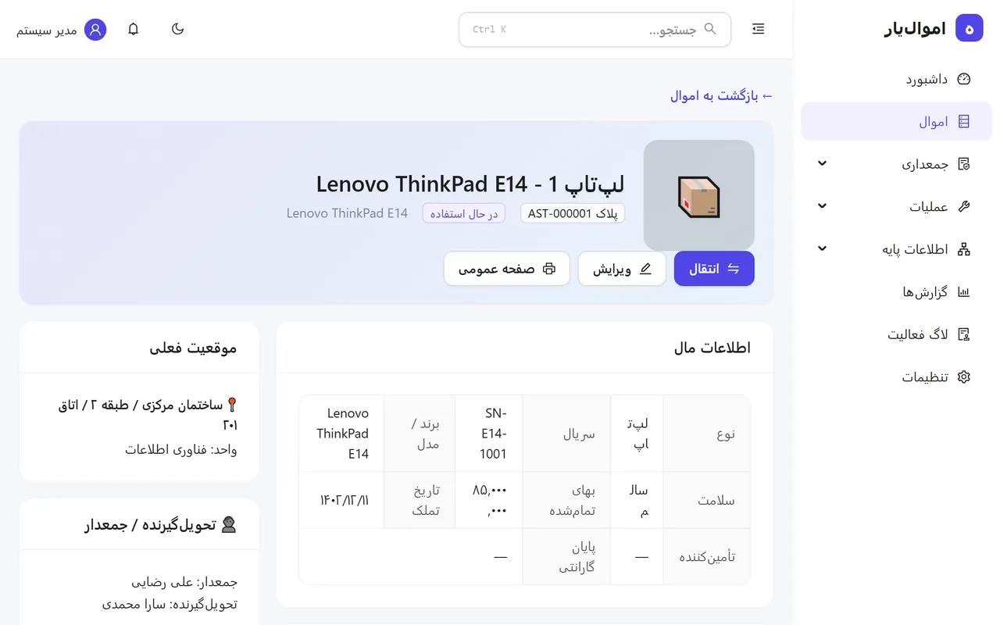</td>
</tr>
</table>

### 🎨 Rangnama: AI paint visualizer · [repo](https://github.com/erfanmohammadi1998/rangnama)

The customer uploads a photo of a room or building; **Mask2Former semantic segmentation** and **SAM** find the walls, and a Lab-space color engine repaints them from the catalog while keeping the original light, shadow and texture. Includes a smart brush, before/after slider, paint calculator, lead form and admin dashboard. All models run **locally**, with no per-image API cost.

`Python` `FastAPI` `PyTorch` `Mask2Former` `SAM` `OpenCV` `JavaScript`

<table>
<tr>
<td width="50%">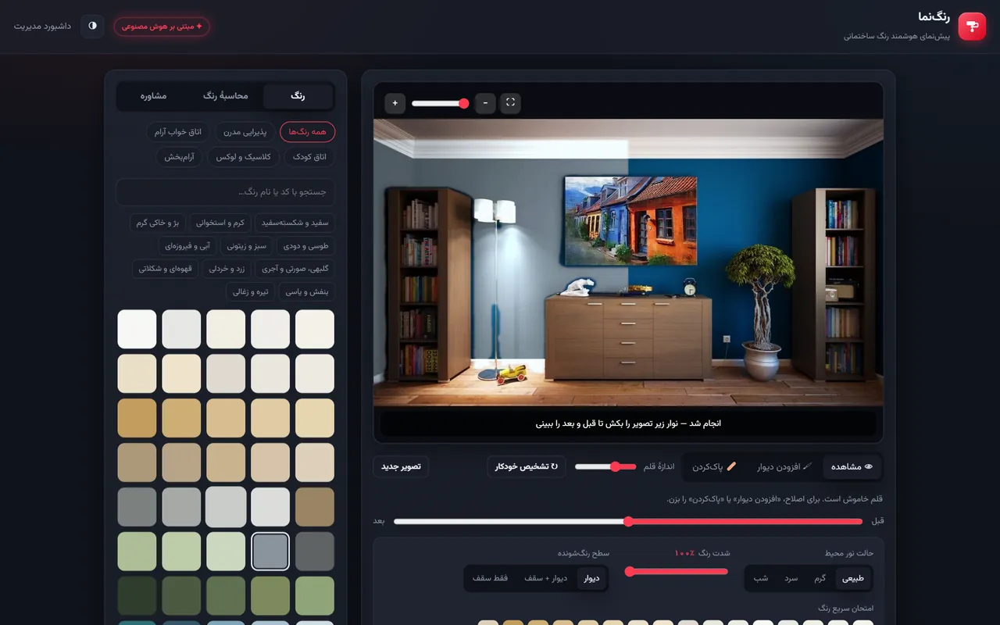</td>
<td width="50%">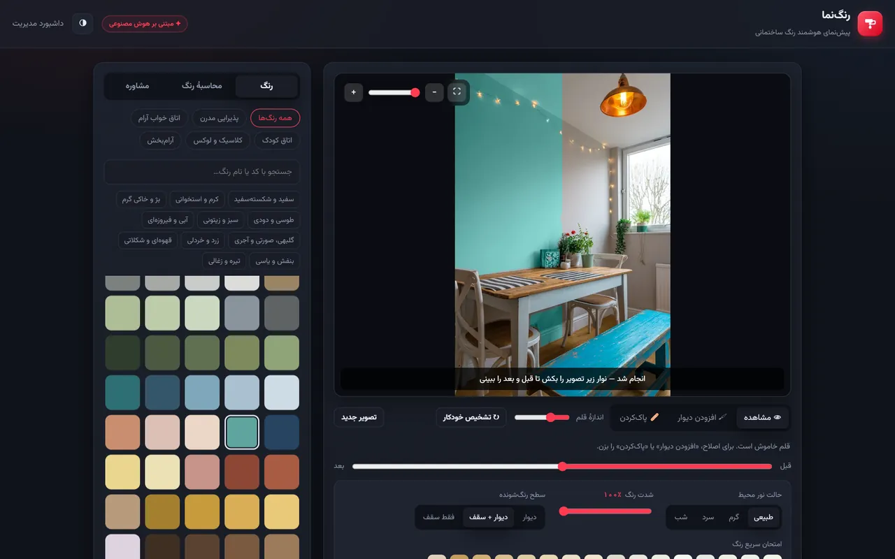</td>
</tr>
</table>

### 🎓 Avana: multi-tenant SaaS for language schools *(Houshiva)*

A cloud platform that language schools subscribe to (monthly or yearly, with a free trial). It covers students, teachers, courses, attendance, placement and online exams, tuition, a **video store with subscriptions and topic bundles**, certificates and financial reports. Users log in with an **SMS one-time code**. It is **multi-tenant and white-label**, with an owner console for managing every customer school.

`Django REST Framework` `React` `Multi-tenancy` `Subscriptions & billing`

<table>
<tr>
<td width="50%"></td>
<td width="50%"></td>
</tr>
</table>

### 💼 Karnama: job search & résumé builder PWA *(Houshiva)* · [repo](https://github.com/erfanmohammadi1998/karnama)

A mobile-first app for job seekers:
- **searches Iranian and international job sources at once**, merging results and removing duplicates
- a **résumé builder** (fa / en / de) with live preview, templates, photo and PDF export
- an application tracker, job alerts, personalized suggestions and job-ad translation

`Django REST Framework` `React` `Vite` `PWA`

<table>
<tr>
<td width="50%" align="center"></td>
<td width="50%" align="center"></td>
</tr>
</table>

### 📡 Market Radar: competitor price intelligence

Automatically collects competitor prices from online stores, matches equivalent products across brands and shows the brand's market positioning, with an *evidence chain* that traces every dashboard number back to its raw source record.

`Django` `DRF` `Celery` `Redis` `PostgreSQL` `React`

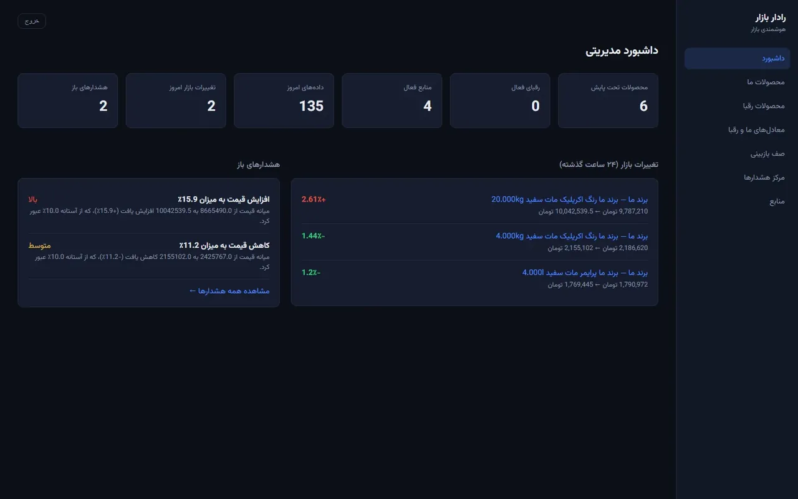

### 🏢 Enterprise systems

| | |
|---|---|
| 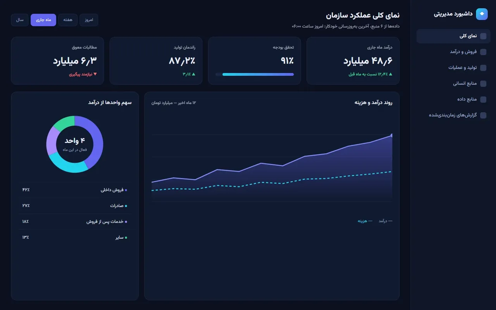 **📊 Management Dashboard & Performance Analytics** One dashboard over the ERP data for HR, accounting, assets, inventory, cash, maintenance and market pricing, with HR and quality chatbots and per-module access. `React` `Ant Design` `Recharts` `Python` `SQL Server` | 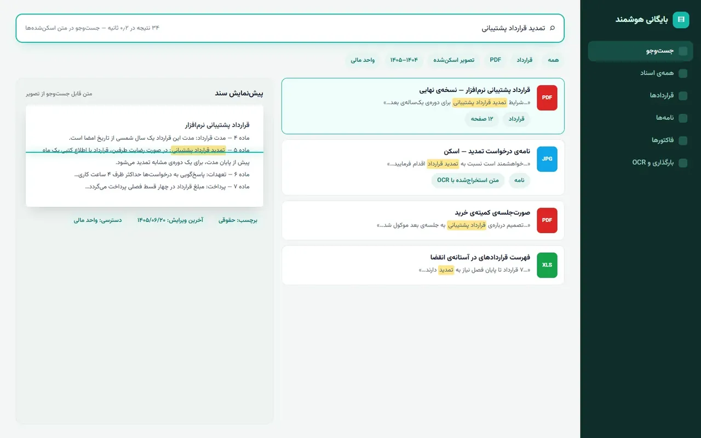 **🗃️ Smart Document Management** Company-wide document archive with OCR text extraction from images and PDFs, so documents are searchable by their content. `Django` `React` `OCR` `SQL Server` |
| 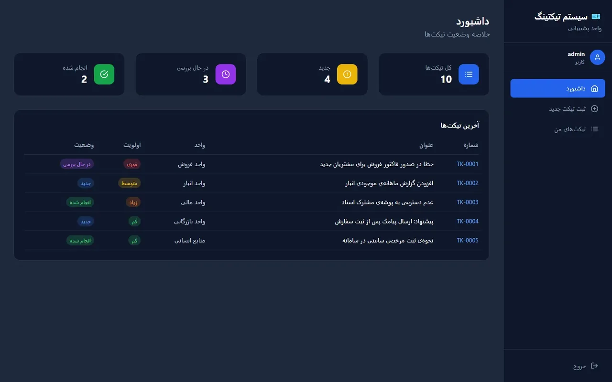 **🎫 Support Ticket System** · [repo](https://github.com/erfanmohammadi1998/ticket-management-system) Internal support desk with automatic numbering, status workflow and role-based access. `Django REST Framework` `JWT` `React` `SQL Server` | 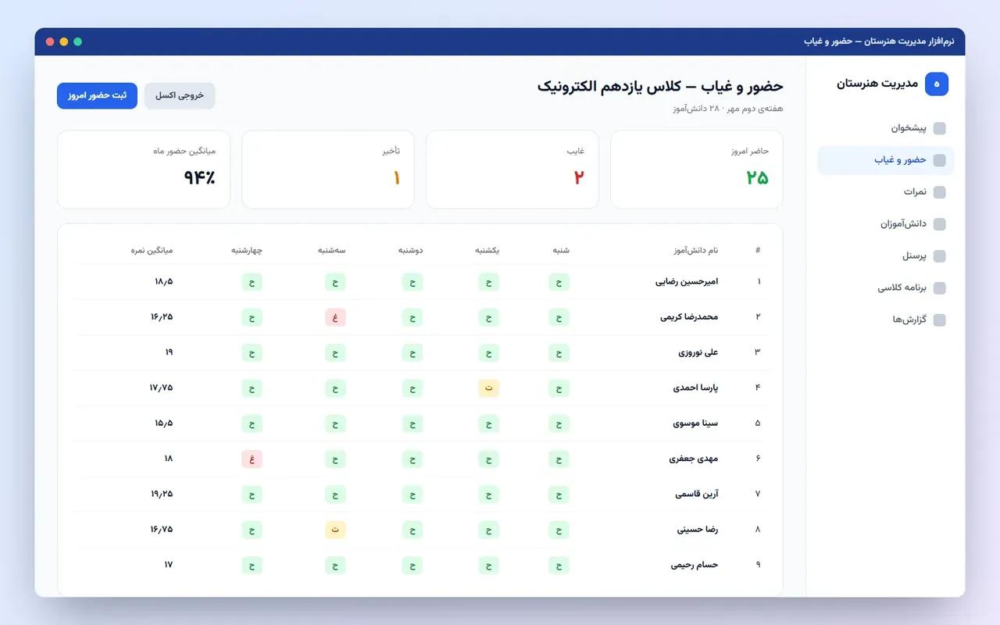 **🏫 School Management Software** Attendance, grades, staff and day-to-day operations for a technical school. `Django` `React` |

**Also built:** 🧭 **Software Knowledge Center**, the IT team's workspace (docs, tasks, phone directory, access control and auditing across three SQL Server instances, SQL console, single sign-on hub for internal apps) · 🛠️ **PM Factory**, a CMMS rewrite of the ERP's VB.NET/WinForms maintenance module (Django, React, TypeScript, PostgreSQL) · 💰 **Price Inquiry & Asset Valuation**.

### 🏭 Industrial production-line tools

| | |
|---|---|
| 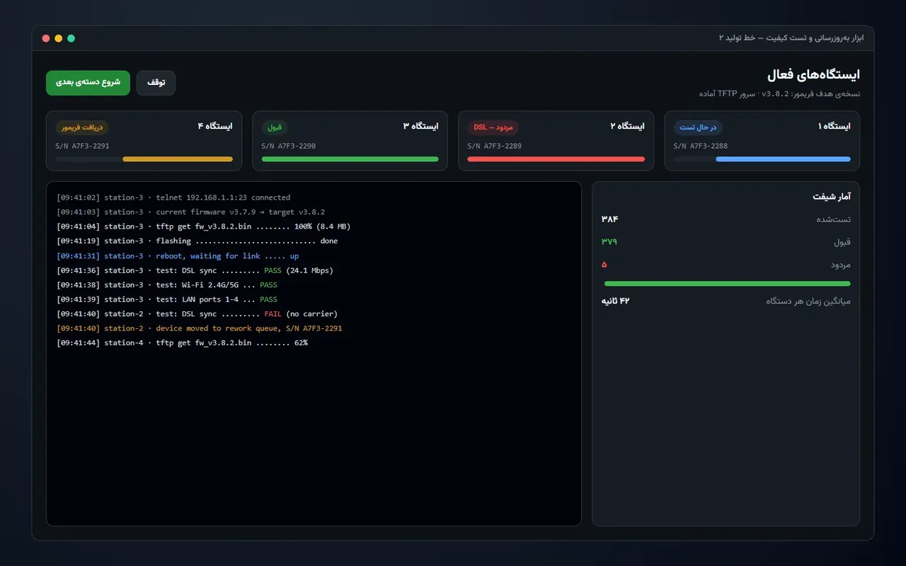 **Modem production-line automation** Python tools that update firmware and run quality tests on modems across multiple stations of an industrial line. | 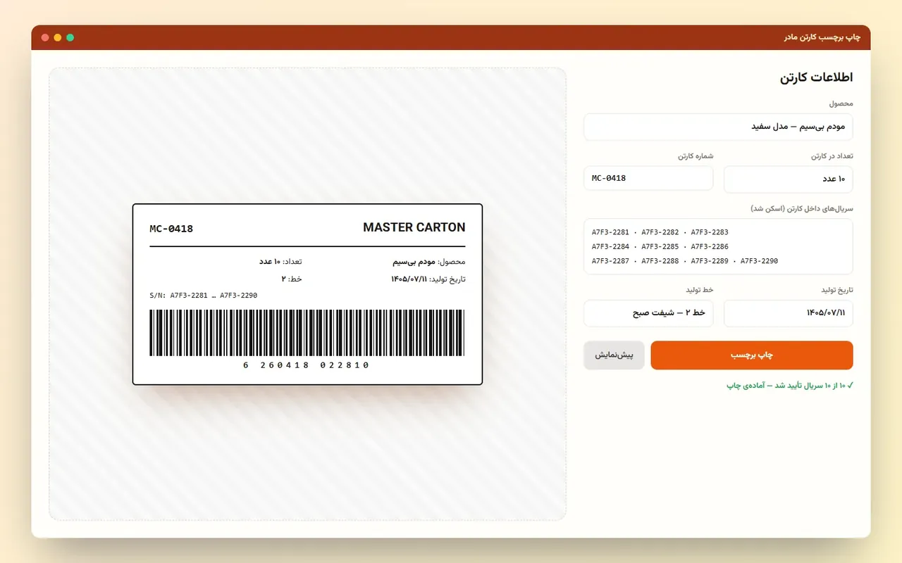 **Master-carton label printing** Fast, accurate label printing for master cartons on the production line, with barcodes and serial ranges. |

### 🌐 Client websites & apps *(Houshiva)*

| | | |
|---|---|---|
| 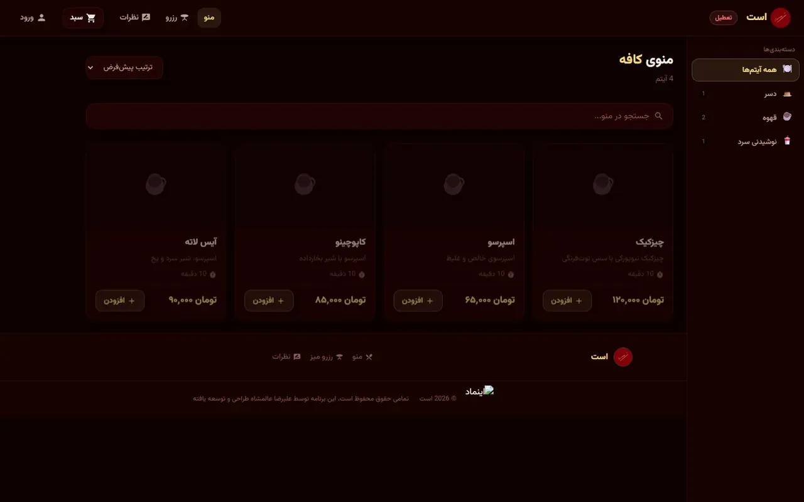 **Rose Café**: online ordering and table reservation with SMS login | 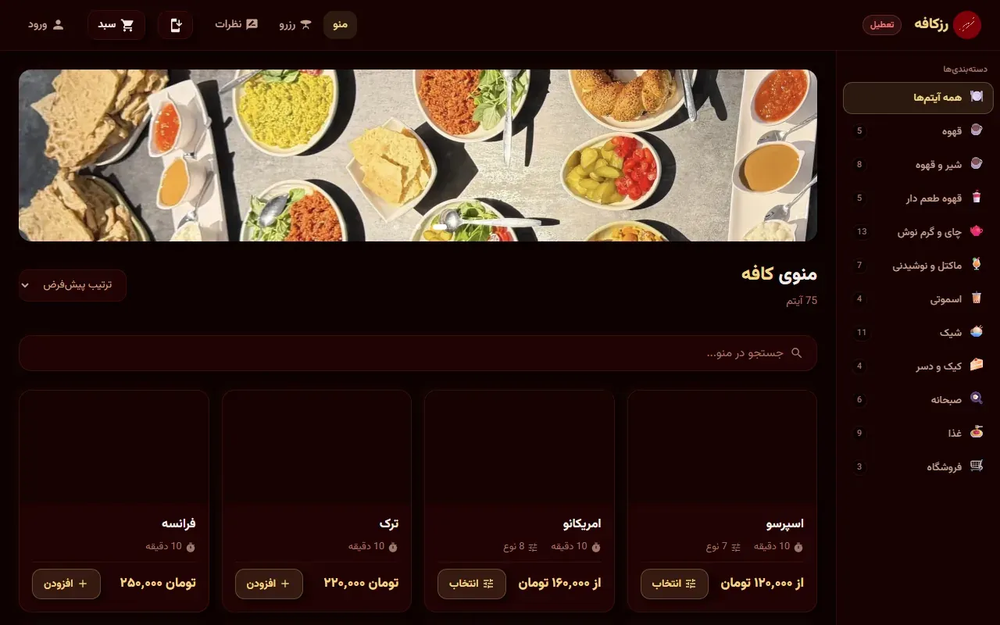 **Digital café menu**: dynamic menu, admin panel and online orders | 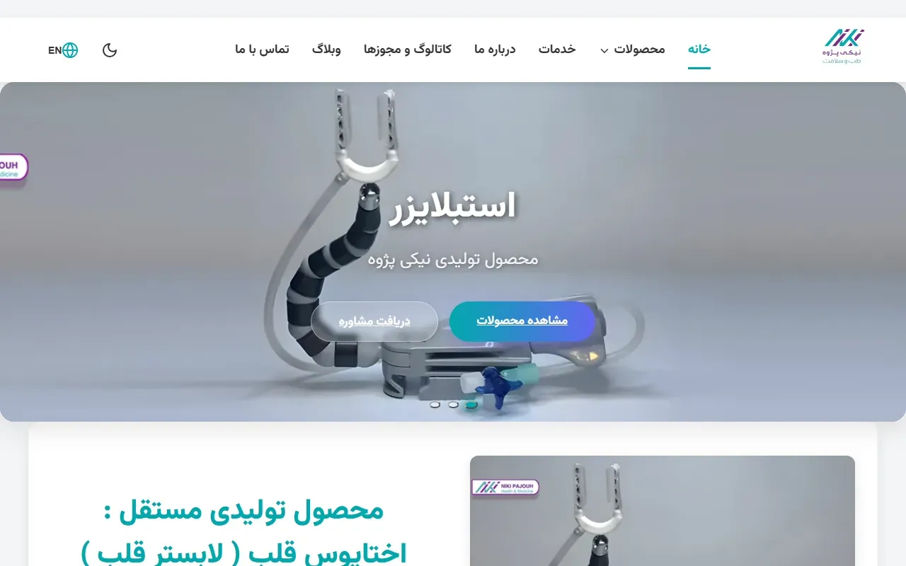 **Nikiteb corporate website**: relaunch from WordPress to React + Django |
| 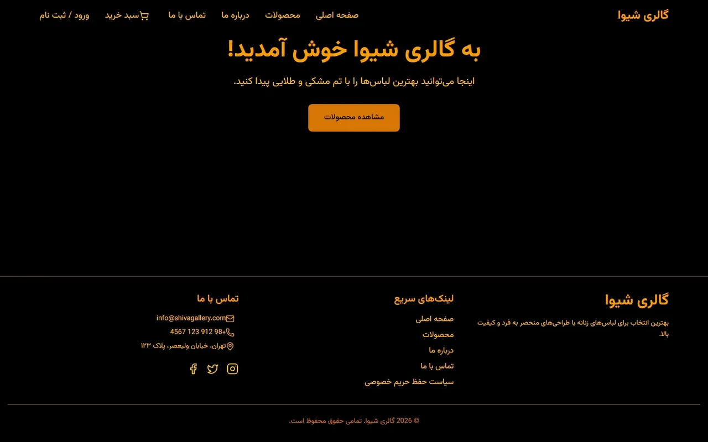 **Shiva Gallery**: women's clothing e-shop with cart, payment and admin |  **Barber shop landing page**: services, team and reviews | 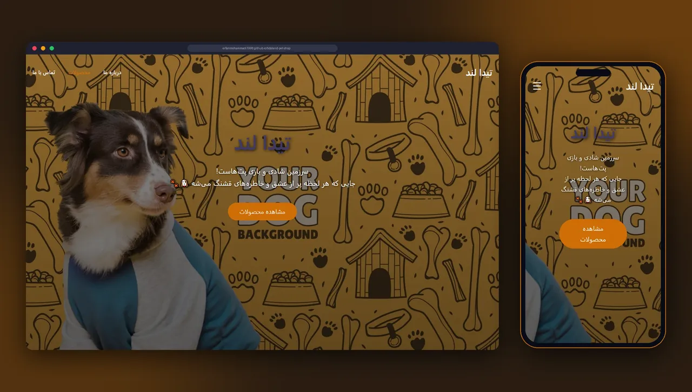 **TidaLand pet shop** · [repo](https://github.com/erfanmohammadi1998/tidaland-pet-shop): pure HTML/CSS multi-page site |

### 🌍 Open-source tools

| | |
|---|---|
| 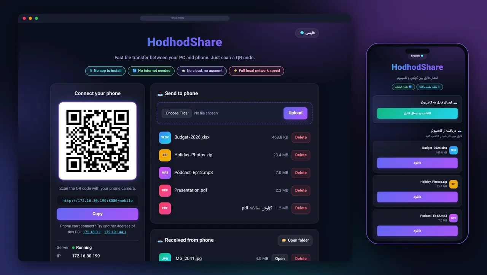 **[HodhodShare](https://github.com/erfanmohammadi1998/HodhodShare)**: share files between a Windows PC and a phone over local Wi-Fi by scanning a QR code. No app, no internet, no cloud; single portable `.exe`, English/Persian UI. `Python` `Flask` `PyInstaller` | 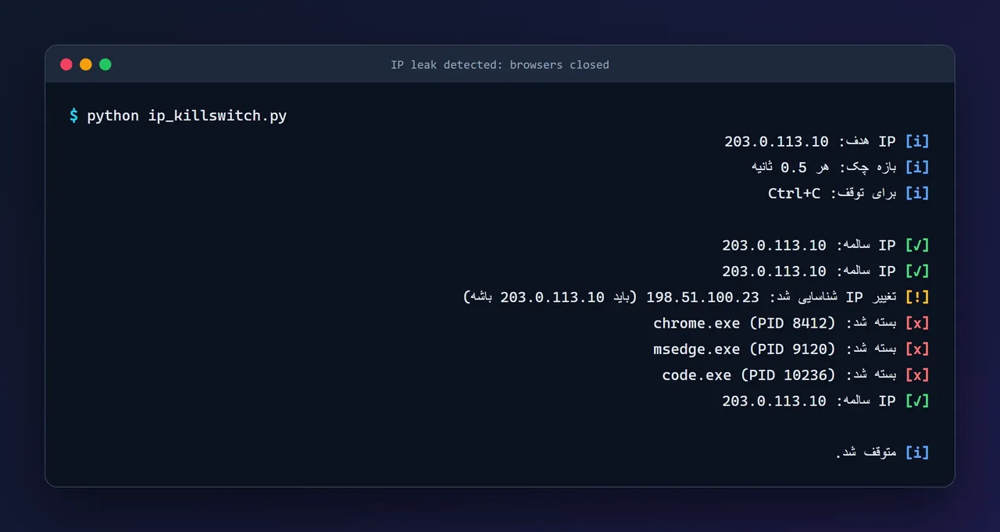 **[ip_killswitch](https://github.com/erfanmohammadi1998/ip_killswitch)**: closes your browsers the moment your VPN or proxy drops, before your real IP can leak. Fail-safe by design. `Python` `psutil` |

### 📂 Public repositories

| Repository | Description |
|---|---|
| [**rezumeban**](https://github.com/erfanmohammadi1998/rezumeban) | Applicant tracking system with careers portal, Kanban pipeline, scorecards and hiring analytics |
| [**amvalyar**](https://github.com/erfanmohammadi1998/amvalyar) | Asset & custody management with QR tagging and mobile stock-taking |
| [**rangnama**](https://github.com/erfanmohammadi1998/rangnama) | AI paint visualizer (Mask2Former + SAM + Lab recoloring) |
| [**karnama**](https://github.com/erfanmohammadi1998/karnama) | Job-seeker PWA: aggregated job search, résumé builder, tracker |
| [**HodhodShare**](https://github.com/erfanmohammadi1998/HodhodShare) | Local Wi-Fi file sharing between PC and phone via QR |
| [**ticket-management-system**](https://github.com/erfanmohammadi1998/ticket-management-system) | Support-ticket system with Django REST Framework, React and SQL Server |
| [**ip_killswitch**](https://github.com/erfanmohammadi1998/ip_killswitch) | VPN-drop watchdog that prevents real-IP leaks |
| [**tidaland-pet-shop**](https://github.com/erfanmohammadi1998/tidaland-pet-shop) | Responsive pet shop website in pure HTML5/CSS3 |
| [**portfolio**](https://github.com/erfanmohammadi1998/portfolio) | My portfolio, live at [erfanmohammadi.ir](https://erfanmohammadi.ir): an interactive architecture map plus an API console you can query. Trilingual (fa / en / de) |

---

## Technical skills

| Area | Skills |
|---|---|
| **Backend** | **Python, Django, Django REST Framework, REST API design** (advanced) · JWT auth, OpenAPI/Swagger · FastAPI · VB.NET (good) |
| **Databases** | **MS SQL Server, T-SQL, PostgreSQL, MySQL** (advanced): performance tuning, execution plans, indexing, stored procedures · SSIS (basic) |
| **Frontend** | React, JavaScript, HTML/CSS, Vite, Tailwind CSS, MUI, Ant Design, Recharts (good) · TypeScript (basic) |
| **DevOps & tools** | Git (advanced) · Docker, Docker Compose, GitLab, nginx, Windows Server services (good) |
| **Reporting & BI** | Crystal Reports (advanced) · Stimulsoft Reports, Power BI, Excel, Access (good) |
| **Other** | OpenCV, Selenium, semantic segmentation with PyTorch (basic) · AI-assisted development |

---

## Experience

**Software Developer & Database Specialist** · Alvan Paint & Resin, Tehran · *07/2022 – present*
Designed, built and maintain 15+ internal business modules · translate business logic into data models with the departments that use them · SQL Server design, tuning and maintenance · backend services and REST APIs · Docker environments · code reviews and technical documentation

**Founder & Software Developer** (part-time) · Houshiva, Tehran · *2026 – present*
Custom software for small and medium-sized businesses: websites, online shops, POS, CRM, inventory and accounting systems, dashboards and API integrations, from requirements analysis to deployment and support

**Professional training & own projects** · *07/2020 – 06/2022*
Specialized in databases and Python (350+ hours of training) · built a CV database (Django + React) and an incident-reporting system

## Education & training

- **Bachelor's degree in Web Programming**, University of Applied Science and Technology (Gostaresh Informatics), Tehran · *09/2026 – present, part-time*
- **Associate degree in Computer Software**, Imam Sadegh Technical College, Tehran · *2015 – 2017*
- **~420 hours of professional training**: SQL Server Performance & Tuning (75 h) · Business Intelligence (90 h) · SQL Server Querying and Advanced T-SQL: window functions & columnstore (75 h) · Python & Advanced Python (90 h) · Power BI (30 h) · Data Analysis (30 h) · AI Engineering (30 h)

---

## Activity

<picture>
  <source media="(prefers-color-scheme: dark)" srcset="https://raw.githubusercontent.com/erfanmohammadi1998/erfanmohammadi1998/gh-pages/github-contribution-grid-snake-dark.svg" />
  
</picture>

---

**Let's build something reliable.**
[erfanmohammadi.ir](https://erfanmohammadi.ir) · [LinkedIn](https://www.linkedin.com/in/erfan-mohammadi77/) · [erfan.mohammadi.alv77@gmail.com](mailto:erfan.mohammadi.alv77@gmail.com)

